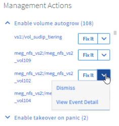

= 使用 Unified Manager 自动修复解决问题
:allow-uri-read: 
:icons: font
:imagesdir: ../media/

[role="lead"]
Unified Manager 可以对某些事件进行全面诊断并提供单一解决方案。如果可用，这些解决方案将显示在信息板，事件详细信息页面以及左侧导航菜单上的工作负载分析选项中。

== 关于此任务

大多数事件都有各种可能的解决方案，这些解决方案显示在事件详细信息页面中，因此您可以使用 ONTAP System Manager 或 ONTAP 命令行界面实施最佳解决方案。

== 步骤

. 要查看可通过 * 信息板 * 修复的事件，请单击 * 信息板 * 。
+

. 要解决 Unified Manager 可以修复的任何问题，请单击 * 修复它 * 按钮。

