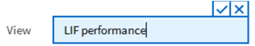

= 计划报告
:allow-uri-read: 
:icons: font
:imagesdir: ../media/

[role="lead"]
如果您希望为某个视图计划定期生成报告并将其作为报告进行分发、则可以计划此报告。

== 开始之前

* 您必须具有应用程序管理员或存储管理员角色。
* 您必须已在 * 常规 * > * 通知 * 页面中配置 SMTP 服务器设置，以便报告引擎可以将报告作为电子邮件附件从 Unified Manager 服务器发送到收件人列表。
* 必须将电子邮件服务器配置为允许随生成的电子邮件一起发送附件。

== 关于此任务

按照以下步骤测试并计划要为视图生成的报告。选择或自定义要使用的视图。以下操作步骤使用的网络视图可显示网络接口的性能，但您可以使用所需的任何视图。

== 步骤

. 打开视图。此示例使用显示 LIF 性能的默认网络视图。在左侧导航窗格中，单击 "* 网络 ">> * 网络接口 * 。
. 根据需要自定义视图。
. 自定义此视图后，您可以在 * 视图 * 字段中提供一个唯一名称，然后单击复选标记以保存此视图。
+

. 在计划或共享报告之前、请下载* CSV *或* PDF *文件格式的报告以查看输出。
+
使用已安装的应用程序打开文件、例如Microsoft Excel (CSV)或Adobe Acrobat (PDF)。

. 如果您对报告满意，请单击 * 已计划报告 * 。
. 在*报告计划*页面中、单击*添加计划*。
. 接受默认名称，即视图名称和频率的组合，或者自定义 * 计划名称 * 。
. 要首次测试计划的报告，请仅将自己添加为 * 收件人 * 。如果满意，请添加所有报告收件人的电子邮件地址。
. 指定生成报告并将其分发给收件人的频率(*每日*或*每周*)以及日期(如果是每周)和时间。
. 选择格式：* PDF *或* CSV *。
. 单击复选标记以保存报告计划。
+
image::../media/scheduled-reports.gif[已计划报告]

+
报告将立即作为测试发送。之后，报告将生成，并以指定频率通过电子邮件发送给列出的收件人。

